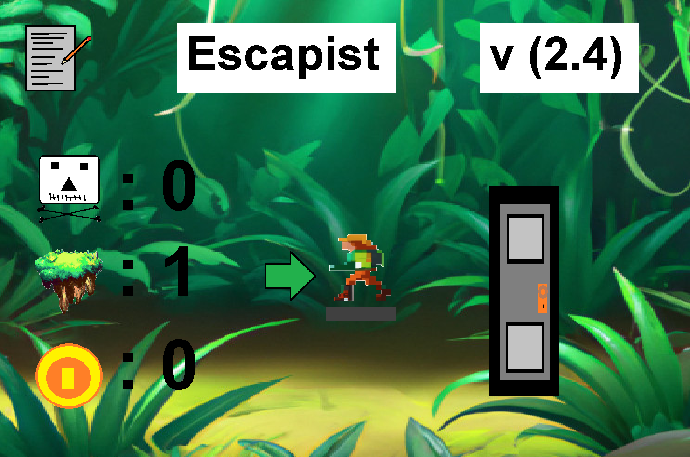
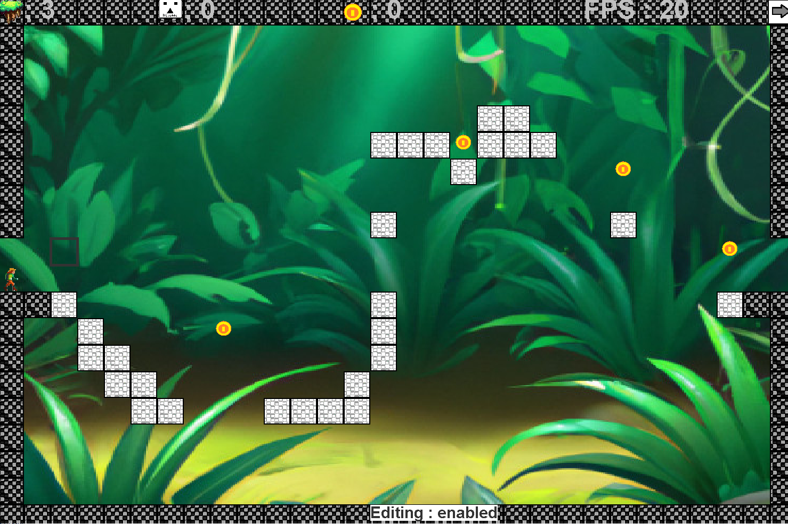
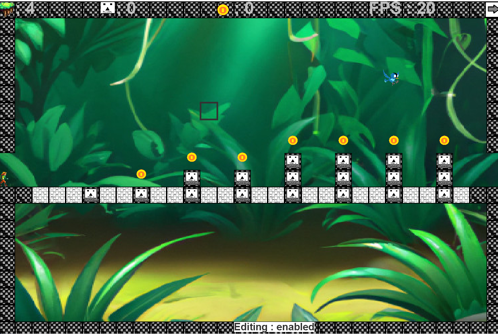
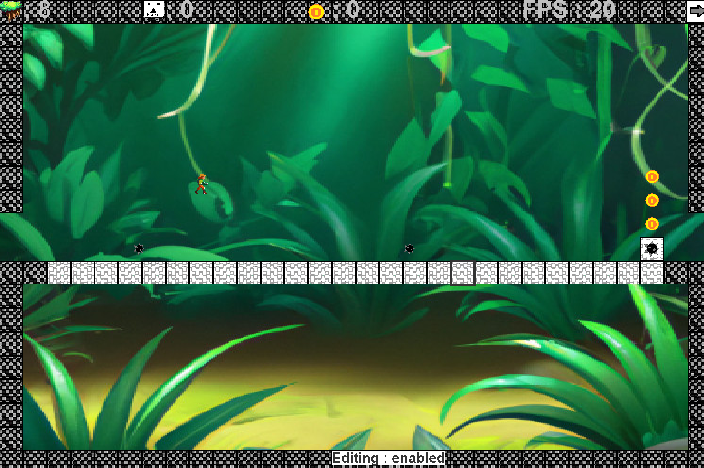

# Escapist
A dungeon crawler / jump&run. Once loaded, click the door to jump into the adventure

  

and maneuver through 14 different levels:

  
  
  

Alternatively, you can design your own levels, by clicking on the notepad and use **asf123** as the password.

  

# Java version
The source code is written for Java 7 (51) and the .jar was compiled with the same version.
